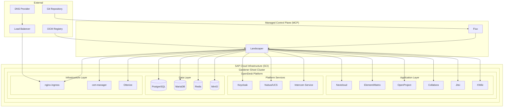
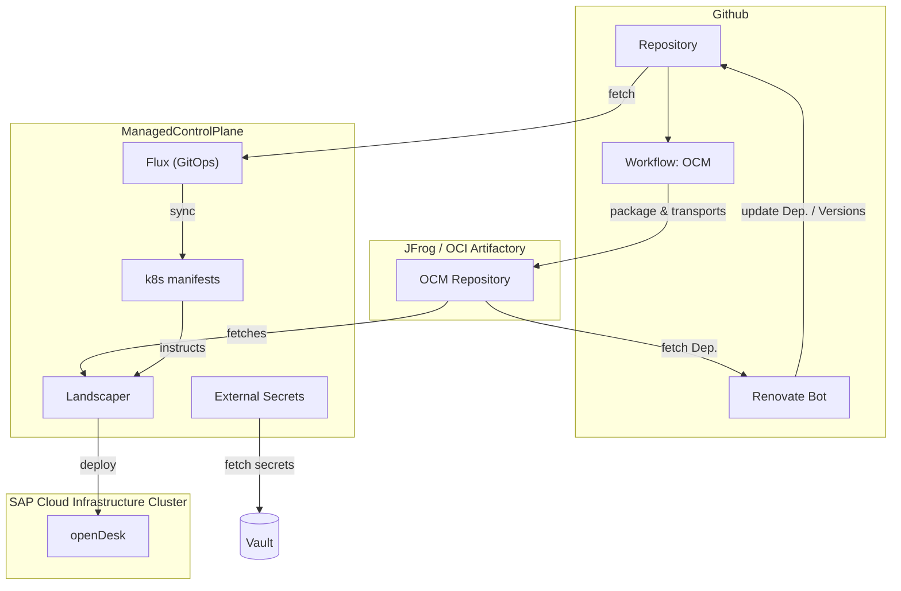
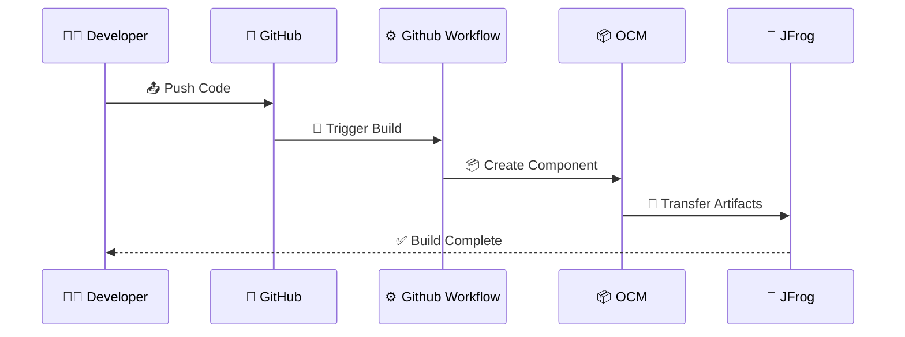
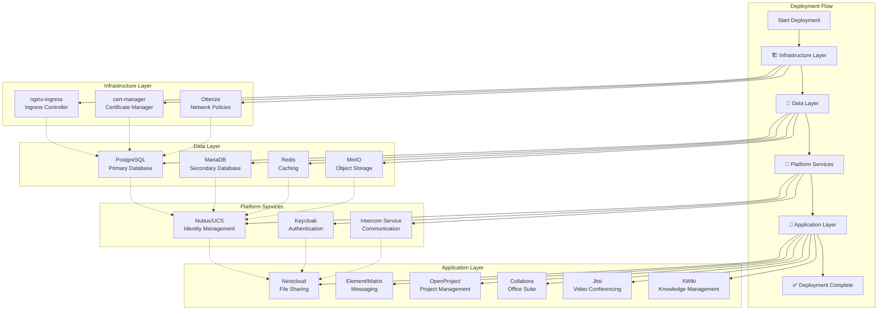

# 🏢 OpenDesk PoC - Cloud-Native Digital Workplace Platform

> [!CAUTION] 📝 Note
> This documentation reflects the current state of the PoC implementation. For production deployments, additional security hardening, monitoring, and operational procedures should be implemented.

## 📋 Overview

This repository contains a Proof of Concept (PoC) implementation of OpenDesk, a comprehensive digital workplace platform built on cloud-native technologies. The project demonstrates the deployment and management of a complete office suite including collaboration tools, communication platforms, file sharing, and project management applications using modern Kubernetes orchestration patterns from a Managed Control Plane with Landscaper and Open Component Model.

## 🏗️ Architecture

### 🛠️ Technology Stack

- **Kubernetes**: Container orchestration platform
- **Open Component Model (OCM)**: Component-based software delivery
- **Landscaper**: GitOps-based deployment orchestration
- **Flux**: GitOps toolkit for Kubernetes
- **Helm**: Kubernetes package manager
- **Gardener**: Kubernetes cluster management
- **SAP Cloud Infrastructure**  (SCI): SAP sovereign Cloud infrastructure based on OpenStack

### 📊 Architecture Overview



<details>
<summary><strong> Detailed Architecture </strong></summary>


</details>


### 🔄 Open Component Model Pipeline
A Github Workflow [`.github/workflows/ocm-component-check.yml`](./.github/workflows/ocm-component-check.yml) is used to find, package and transfer all `./ocm/**/component-constructor.yaml` to an an OCI repository.



### 🧩 Core Components

<details>
<summary><strong>The OpenDesk platform consists of the following integrated applications:</strong></summary>

#### 💬 Communication & Collaboration
- **Element/Matrix**: Real-time messaging and chat platform
- **Jitsi**: Video conferencing solution
- **Synapse**: Matrix homeserver for federated communication

#### 📁 File Management & Office Suite
- **Nextcloud**: File sharing and collaboration platform
- **Collabora Online**: Office document editing
- **CryptPad**: Privacy-focused collaborative editing

#### 📊 Project & Knowledge Management
- **OpenProject**: Project management and collaboration
- **XWiki**: Knowledge management and wiki platform
- **Notes**: Note-taking application

#### 🔐 Identity & Access Management
- **Nubus/UCS**: Identity and directory services
- **Keycloak**: Identity and access management
- **Guardian**: Access control and security

#### ⚙️ Infrastructure Services
- **PostgreSQL**: Primary database
- **MariaDB**: Secondary database for specific applications
- **Redis**: In-memory data store
- **MinIO**: Object storage
- **Postfix**: Mail transfer agent
- **ClamAV**: Antivirus scanning

</details>

## 📂 Repository Structure

```
poc-bmi-opendesk/
├── README.md                    # Comprehensive documentation (this file)
├── Makefile                     # Build and deployment automation
├── renovate.json                # Dependency update configuration
├── converge-cloud/              # SAP Cloud Infrastructure k8s cluster specific configurations
├── credentials/                 # Credential management
├── mcp/                         # Managed Control Plane configurations
│   ├── flux/                    # Flux GitOps configurations
│   └── landscaper/              # Landscaper deployment definitions
│       ├── cc-cluster-opendesk/     # cluster "OpenDesk" which was used to install openDesk via helmfiles to have an working reference architecture
│       ├── cc-cluster-opendeskocm/  # cluster "OpenDeskOCM" which is managed by Landscaper via OCM
│       └── local/                   # Local kind/minikube/k3d development setup
├── mcp-order-api/              # MCP Ordering API configurations
└── ocm/                        # Open Component Model content layer
    ├── apps/                   # OpenDesk HelmFile Application component definitions
    └── k8s-landscaper-blueprint/ # Kubernetes deployment blueprints
```

## 🚀 Deployment Architecture

### 📦 Open Component Model (OCM) Integration

The project uses OCM for component-based software delivery:

- **Component Descriptors**: Define software components and their dependencies
- **Resource References**: Manage Helm charts, container images, and configuration
- **Component Constructors**: Automate component building and packaging

### 🌱 Landscaper Orchestration

Landscaper manages the deployment lifecycle:

- **Blueprints**: Define deployment templates and dependencies
- **Installations**: Specify target environments and configurations
- **Deploy Items**: Individual deployment units with dependency management
- **Targets**: Kubernetes cluster connection definitions

### 🔄 GitOps with Flux

Flux provides continuous deployment capabilities:

- **Git Repository Sources**: Monitor repository changes
- **Kustomizations**: Apply configurations automatically
- **Reconciliation**: Ensure desired state matches actual state

## ✅ Prerequisites

### 🏗️ Infrastructure Requirements

1. **local tooling**: [OCM CLI tools](https://ocm.software/docs/getting-started/installation/) & [kubectl](https://kubernetes.io/de/docs/reference/kubectl/) installed
2. **`ManagedControlPlane`**: Access to [`ManagedControlPlane`](https://pages.github.tools.sap/cloud-orchestration/docs/managed-control-planes/get-started/get-started-mcp-connect) cluster with [Landscaper installed](https://pages.github.tools.sap/cloud-orchestration/docs/managed-control-planes/get-started/get-started-mcp-configure)
3. JFrog / OCI Artifactory [technical user](https://pages.github.tools.sap/Common-Repository/Artifactory-Internet-Facing/commonrepo-onboard/#technical-users)
4. [Github Repository](https://pages.github.tools.sap/github/getting-started) & [Github Action Runner](https://pages.github.tools.sap/github/features-and-how-tos/features/actions/introduction)
5. **SAP Cloud Infrastructure Account**: account on Internet-facing domain (e.g., HCP03)
6. **Gardener Project**: Workload/Shoot Cluster on SAP Cloud Infrastructure deployed and exposed to internet
7. **Load Balancer**: Internet-facing ingress controller
8. **DNS Management**: Wildcard certificate support

## 📖 Installation Guide

### 🏗️ Phase 1: Infrastructure Setup

#### 1️⃣ SAP Cloud Infrastructure Configuration

```bash
# Apply service account token on SAP Cloud Infrastructure cluster
kubectl apply -f converge-cloud/ccloud-sa-token.yaml

# Extract information of this service account in order 
# to create a kubeconfig secret ccloud-hcp03-opendeskocm-service-account-kubeconfig 
# for Landscaper on ManagedControlPlane to be able to manage openDesk instance
```

#### 2️⃣ Certificate Management

Create [required TLS certificate](https://gitlab.opencode.de/bmi/opendesk/deployment/opendesk/-/blob/develop/docs/getting-started.md#dns) secret on Gardener Shoot Cluster for your own domain: [`converge-cloud/ccloud-hcp03-opendeskocm-tls-cert.yaml`](./converge-cloud/ccloud-hcp03-opendeskocm-tls-cert.yaml)


#### 3️⃣ Core Infrastructure Components Configuration

Configure nginx-ingress with proper annotations at `mcp/landscaper/cc-cluster-opendeskocm/data-object-base.yaml`:
```yaml
annotations:
  ingressclass.kubernetes.io/is-default-class: "true"
  loadbalancer.openstack.org/class: internet
  dns.gardener.cloud/class: garden
  dns.gardener.cloud/dnsnames: '*'
  dns.gardener.cloud/ttl: '600'
```

Configure openDesk core components at `mcp/landscaper/cc-cluster-opendeskocm/data-object-environments-defaults.yaml`.

#### 🔐 Security & Credential Management

> [!IMPORTANT]  
> **Best Practice**: Leverage [**SAP Vault**](http://vault.tools.sap) and [**External Secrets Operator**](https://external-secrets.io/latest/) on your `ManagedControlPlane` to [**securely handle**](https://pages.github.tools.sap/cloud-orchestration/docs/use-cases/advanced/vault) all credentials!

<a id="required-kubernetes-secrets"></a>
#### Required Kubernetes Secrets

The following **Kubernetes secrets** must be present on your `ManagedControlPlane` and either be created manually or synced via [**External Secrets Operator**](https://pages.github.tools.sap/cloud-orchestration/docs/use-cases/advanced/vault):

| Secret Name                                               | Documentation                                                                                                                         | Purpose                                                                                                                       |
| --------------------------------------------------------- | ------------------------------------------------------------------------------------------------------------------------------------- | ----------------------------------------------------------------------------------------------------------------------------- |
| **`ccloud-hcp03-opendeskocm-service-account-kubeconfig`** | SAP Cloud Infrastructure Cluster Service Account kubeconfig                                                                           | K8s Service Account credentials for `Landscaper` to access SAP Cloud Infrastructure Cluster and manage openDesk installation. |
| **`github-pull-secret`**                                  | [GitHub Access Token](https://pages.github.tools.sap/cloud-orchestration/docs/managed-control-planes/features/gitops#private-source)  | Access private Github repository access                                                                                       |
| **`image-pull-secret`**                             | [JFrog Identity Token](https://pages.github.tools.sap/cloud-orchestration/docs/use-cases/advanced/jfrog_access#create-identity-token) | Credentials to access JFrog/OCI artifactory in which OCM artifact are stored                                                  |

### 🚀 Phase 2: Application Deployment

#### 📋 Deployment Sequence

The Landscaper blueprint defines a specific deployment order (`ocm/k8s-landscaper-blueprint/deploy-execution.yaml`):



<details>
<summary><strong>Layer and Service items:</strong></summary>

1. **🏗️ Infrastructure Layer**
   - Ingress Controller (nginx-ingress)
   - Certificate Manager (cert-manager)
   - Network Policies (Otterize)

2. **💾 Data Layer**
   - PostgreSQL (primary database)
   - MariaDB (secondary database)
   - Redis (caching)
   - MinIO (object storage)

3. **🔧 Platform Services**
   - Nubus/UCS (identity management)
   - Keycloak (authentication)
   - Intercom Service (communication)

4. **📱 Application Layer**
   - Nextcloud (file sharing)
   - Element/Matrix (messaging)
   - OpenProject (project management)
   - Collabora (office suite)
   - Jitsi (video conferencing)
   - XWiki (knowledge management)

</details>

#### ⚙️ Configuration Management

Each application is configured through:

- **Helm Values**: Application-specific configuration -> `ocm/k8s-landscaper-blueprint/deploy-execution.yaml` & `ocm/k8s-landscaper-blueprint/helmfile/**`
- **Secrets Management**: Automated password generation -> `ocm/k8s-landscaper-blueprint/blueprint.yaml`
- **Theme Integration**: Consistent branding across applications -> `mcp/landscaper/cc-cluster-opendeskocm/data-object-theme.yaml`

### 🔄 Phase 3: GitOps Setup

> [!IMPORTANT]
> ⚠️ Review and modify all files before you apply them!

#### 🔄 Flux Configuration

```bash
# Apply Git repository source
kubectl apply -f mcp/flux/git-repository.yaml

# Apply Kustomization for continuous deployment
kubectl apply -f mcp/flux/kustomization.yaml
```

#### 🌱 Landscaper Installation

The following files should be synced via `flux` on the MCP!

```bash
# manual apply target cluster configuration
kubectl apply -f mcp/landscaper/cc-cluster-opendeskocm/target.yaml

# manual apply data objects (configuration)
kubectl apply -f mcp/landscaper/cc-cluster-opendeskocm/data-object-*.yaml

# manual apply installation
kubectl apply -f mcp/landscaper/cc-cluster-opendeskocm/installation.yaml
```

## ⚙️ Configuration Management

### 🔐 Secret Management

Secrets are automatically generated using deterministic hashing at `ocm/k8s-landscaper-blueprint/blueprint.yaml` -> `importExecutions[].name: "secrets".template...`:

```yaml
# example
secrets:
  postgresql:
    postgresUser: {{ "sovereign-workplace postgres postgres_user" | sha1sum | quote }}
  keycloak:
    adminPassword: {{ "sovereign-workplace keycloak adminPassword" | sha1sum | quote }}
  nextcloud:
    adminPassword: {{ "sovereign-workplace nextcloud nextcloud_admin_user" | sha1sum | quote }}
```

### 🎨 Theme Customization

The platform supports comprehensive theming at `mcp/landscaper/cc-cluster-opendeskocm/data-object-theme.yaml`:

- **Logos**: SVG and PNG formats for different applications
- **Favicons**: Application-specific icons
- **Stylesheets**: Custom CSS for branding
- **Colors**: Consistent color schemes across applications

## 🔧 Troubleshooting

### ⚠️ Common Issues

1. **🔒 Certificate Problems**
   - Verify cert-manager installation
   - Check DNS propagation
   - Validate certificate annotations

2. **🌐 Ingress Issues**
   - Confirm load balancer IP assignment
   - Verify DNS configuration
   - Check ingress controller logs

3. **🚀 Application Startup**
   - Review pod logs for specific applications
   - Check database connectivity
   - Verify secret availability

### 🐛 Debugging Commands

```bash
# Check Landscaper installation status on ManagedControlPlane
kubectl get installations -n default

# Monitor Landscaper deployment progress on ManagedControlPlane
kubectl get deployitems -n default

# Check application pods on SAP Cloud Infrastructure cluster
kubectl get pods -n default

# Review application logs on SAP Cloud Infrastructure cluster
kubectl logs -f deployment/<app-name> -n default
```
### 📦 OCM Commands

```bash
# lookup of available component versions
ocm get componentversions mcp-blueprints.common.repositories.cloud.sap/ocm//opendesk.poc.sap.com/base 
```
<details>
<summary><strong>example</strong></summary>

```bash
ocm get componentversions mcp-blueprints.common.repositories.cloud.sap/ocm//opendesk.poc.sap.com/base                          
COMPONENT                 VERSION           PROVIDER
opendesk.poc.sap.com/base 0.0.2-61-g6ba43a8 opendesk
opendesk.poc.sap.com/base 0.0.2-66-gb8190c0 opendesk
opendesk.poc.sap.com/base 0.0.2-68-gc6b97e1 opendesk
opendesk.poc.sap.com/base 0.1.1-1-ga5a48ab  opendesk
opendesk.poc.sap.com/base 0.1.1-20-gc2359f3 opendesk
opendesk.poc.sap.com/base 0.1.1-25-g03d7a5a opendesk
opendesk.poc.sap.com/base 0.1.1-4-gf608d3c  opendesk
opendesk.poc.sap.com/base 0.1.2-3-gd008b85  opendesk
opendesk.poc.sap.com/base 0.1.2-6-gdfa6567  opendesk
opendesk.poc.sap.com/base 0.1.2-9-ge86e0ee  opendesk
```
</details>
</br>

```bash
# lookup of resources of a specific component version
ocm get resources mcp-blueprints.common.repositories.cloud.sap/ocm//opendesk.poc.sap.com/base:0.1.2-6-gdfa6567
```

<details>
<summary><strong>example</strong></summary>

```bash
ocm get resources mcp-blueprints.common.repositories.cloud.sap/ocm//opendesk.poc.sap.com/base:0.1.2-6-gdfa6567   
NAME                     VERSION          IDENTITY TYPE      RELATION
blueprint                0.1.2-6-gdfa6567          blueprint local
helm-chart-cert-manager  4.11.6                    helmChart external
helm-chart-ingress-nginx 4.11.6                    helmChart external
image-ingress-nginx      1.12.2                    ociImage  external
```
</details>
</br>

```bash
# lookup of all referenced resources of a specific component version
ocm get resources mcp-blueprints.common.repositories.cloud.sap/ocm//opendesk.poc.sap.com/base:0.1.2-6-gdfa6567 -r -otree
```

<details>
<summary><strong>example</strong></summary>

```bash
ocm get resources mcp-blueprints.common.repositories.cloud.sap/ocm//opendesk.poc.sap.com/base:0.1.2-6-gdfa6567 -r -otree
COMPONENT                                                 NAME                                                 VERSION          IDENTITY TYPE      RELATION
└─ opendesk.poc.sap.com/base                                                                                   0.1.2-6-gdfa6567                    
   ├─                                                     blueprint                                            0.1.2-6-gdfa6567          blueprint local
   ├─                                                     helm-chart-cert-manager                              4.11.6                    helmChart external
   ├─                                                     helm-chart-ingress-nginx                             4.11.6                    helmChart external
   ├─                                                     image-ingress-nginx                                  1.12.2                    ociImage  external
   ├─                                                     k8s-manifests                                        0.1.2-6-gdfa6567          blob      local
   ├─ opendesk.poc.sap.com/collabora                      collabora                                            0.1.2-6-gdfa6567                    
   │  └─                                                  helm-chart-collabora-online                          1.1.41                    helmChart external
   ├─ opendesk.poc.sap.com/cryptpad                       cryptpad                                             0.1.2-6-gdfa6567                    
   │  └─                                                  helm-chart-cryptpad                                  0.0.20                    helmChart external
   ├─ opendesk.poc.sap.com/element                        element                                              0.1.2-6-gdfa6567                    
   │  ├─                                                  helm-chart-matrix-neoboard-widget                    3.5.1                     helmChart external
   │  ├─                                                  helm-chart-matrix-neochoice-widget                   3.5.1                     helmChart external
   │  ├─                                                  helm-chart-matrix-neodatefix-bot                     3.5.1                     helmChart external
   │  ├─                                                  helm-chart-matrix-neodatefix-widget                  3.5.1                     helmChart external
   │  ├─                                                  helm-chart-opendesk-element                          6.1.3                     helmChart external
   │  ├─                                                  helm-chart-opendesk-matrix-user-verification-service 6.1.3                     helmChart external
   │  ├─                                                  helm-chart-opendesk-synapse                          6.1.3                     helmChart external
   │  ├─                                                  helm-chart-opendesk-synapse-create-account           6.1.3                     helmChart external
   │  ├─                                                  helm-chart-opendesk-synapse-web                      6.1.3                     helmChart external
   │  └─                                                  helm-chart-opendesk-well-known                       6.1.3                     helmChart external
   ├─ opendesk.poc.sap.com/jitsi                          jitsi                                                0.1.2-6-gdfa6567                    
   │  └─                                                  helm-chart-opendesk-jitsi                            3.1.0                     helmChart external
   ├─ opendesk.poc.sap.com/nextcloud                      nextcloud                                            0.1.2-6-gdfa6567                    
   │  ├─                                                  helm-chart-opendesk-nextcloud                        4.2.0                     helmChart external
   │  └─                                                  helm-chart-opendesk-nextcloud-management             4.2.0                     helmChart external
   ├─ opendesk.poc.sap.com/notes                          notes                                                0.1.2-6-gdfa6567                    
   │  └─                                                  helm-chart-notes                                     2.0.0                     helmChart external
   ├─ opendesk.poc.sap.com/nubus                          nubus                                                0.1.2-6-gdfa6567                    
   │  ├─                                                  helm-chart-intercom-service                          2.12.0                    helmChart external
   │  ├─                                                  helm-chart-nginx-s3-gateway                          1.0.1                     helmChart external
   │  ├─                                                  helm-chart-nubus                                     1.11.2                    helmChart external
   │  └─                                                  helm-chart-opendesk-keycloak-bootstrap               2.6.0                     helmChart external
   ├─ opendesk.poc.sap.com/open-xchange                   open-xchange                                         0.1.2-6-gdfa6567                    
   │  ├─                                                  helm-chart-appsuite-public-sector                    2.20.247                  helmChart external
   │  ├─                                                  helm-chart-dovecot                                   3.1.1                     helmChart external
   │  ├─                                                  helm-chart-opendesk-open-xchange-bootstrap           3.0.1                     helmChart external
   │  └─                                                  helm-chart-ox-connector                              0.19.0                    helmChart external
   ├─ opendesk.poc.sap.com/opendesk-migrations-post       opendesk-migrations-post                             0.1.2-6-gdfa6567                    
   │  └─                                                  helm-chart-opendesk-migrations                       1.7.4                     helmChart external
   ├─ opendesk.poc.sap.com/opendesk-openproject-bootstrap opendesk-openproject-bootstrap                       0.1.2-6-gdfa6567                    
   │  └─                                                  helm-chart-opendesk-openproject-bootstrap            2.2.0                     helmChart external
   ├─ opendesk.poc.sap.com/opendesk-services              opendesk-services                                    0.1.2-6-gdfa6567                    
   │  ├─                                                  helm-chart-certificates                              3.1.1                     helmChart external
   │  ├─                                                  helm-chart-home                                      1.0.2                     helmChart external
   │  └─                                                  helm-chart-static-files                              4.0.1                     helmChart external
   ├─ opendesk.poc.sap.com/openproject                    openproject                                          0.1.2-6-gdfa6567                    
   │  └─                                                  helm-chart-openproject                               10.1.0                    helmChart external
   ├─ opendesk.poc.sap.com/services-external              services-external                                    0.1.2-6-gdfa6567                    
   │  ├─                                                  helm-chart-clamav                                    4.0.6                     helmChart external
   │  ├─                                                  helm-chart-mariadb                                   3.0.3                     helmChart external
   │  ├─                                                  helm-chart-memcached                                 6.7.1                     helmChart external
   │  ├─                                                  helm-chart-minio                                     16.0.10                   helmChart external
   │  ├─                                                  helm-chart-postfix                                   4.0.0                     helmChart external
   │  ├─                                                  helm-chart-postgresql                                2.1.2                     helmChart external
   │  └─                                                  helm-chart-redis                                     18.6.1                    helmChart external
   └─ opendesk.poc.sap.com/xwiki                          xwiki                                                0.1.2-6-gdfa6567                    
      └─                                                  helm-chart-xwiki                                     1.4.4                     helmChart external
```
</details>
</br>


## 👨‍💻 Development and Customization

### ➕ Adding New Applications

1. Create component constructor in `ocm/apps/<app-name>/`
2. Add Helm chart reference and values in `ocm/k8s-landscaper-blueprint/helmfile/apps/<app-name>/`
3. Update deployment execution in `ocm/k8s-landscaper-blueprint/deploy-execution.yaml`
4. Configure dependencies and deployment order

### 🔧 Customizing Existing Applications

1. Modify Helm values templates in `helmfile/apps/<app-name>/values*.yaml.gotmpl`
2. Update theme files in `helmfile/files/theme/`
3. Adjust environment-specific overrides

## 🤝 Contributing

### 🔄 Development Workflow

1. Fork the repository
2. Create feature branch
3. Make changes following established patterns
4. Test in local environment
5. Submit pull request

### 📏 Code Standards

- Follow existing YAML formatting
- Use consistent naming conventions
- Document configuration changes
- Include appropriate comments

## 📚 Support and Documentation

### 🔗 Additional Resources

- [Landscaper Documentation](https://pages.github.tools.sap/kubernetes/landscaper-docs/)
- [OCM Documentation](https://ocm.software/)
- [Flux Documentation](https://fluxcd.io/docs/)
- [Gardener Documentation](https://pages.github.tools.sap/kubernetes/gardener/)