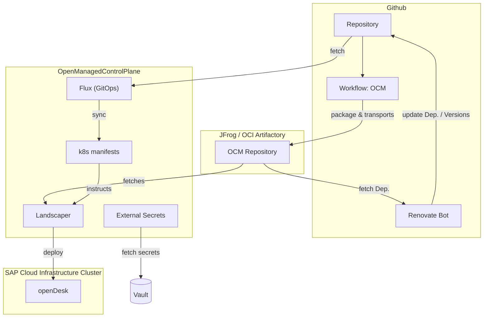
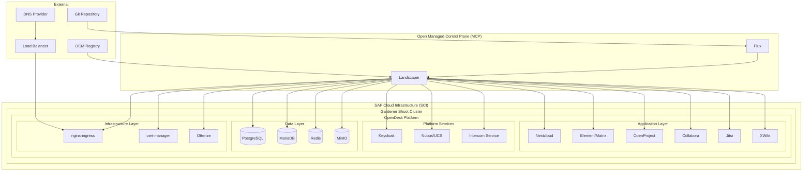
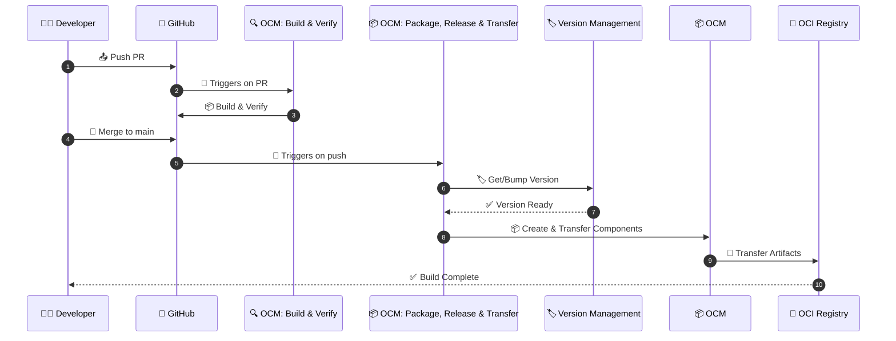
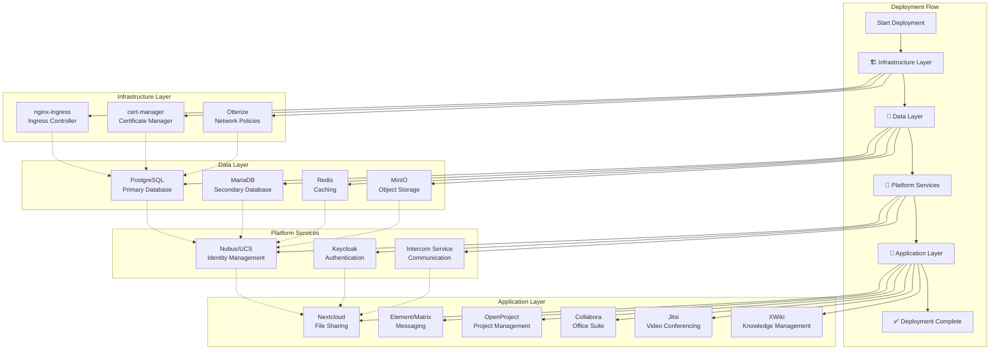

# OpenDesk OCM Landscaper PoC

## About this project

This repository contains a Proof of Concept (PoC) implementation of OpenDesk, a comprehensive digital workplace platform built on cloud-native technologies. The project demonstrates the deployment and management of a complete office suite including collaboration tools, communication platforms, file sharing, and project management applications using modern Kubernetes orchestration patterns from a Open Managed Control Plane with Landscaper and Open Component Model.

## 📑 Contents

- [🏗️ Architecture](#️-architecture)
  - [🛠️ Technology Stack](#️-technology-stack)
  - [📊 Architecture Overview](#-architecture-overview)
  - [🔄 Open Component Model Pipeline](#-open-component-model-pipeline)
  - [🧩 Core Components](#-core-components)
- [📂 Repository Structure](#-repository-structure)
- [🚀 Deployment Architecture](#-deployment-architecture)
  - [📦 Open Component Model (OCM) Integration](#-open-component-model-ocm-integration)
  - [🌱 Landscaper Orchestration](#-landscaper-orchestration)
  - [🔄 GitOps with Flux](#-gitops-with-flux)
- [✅ Prerequisites](#-prerequisites)
  - [🏗️ Infrastructure Requirements](#️-infrastructure-requirements)
- [📖 Installation Guide](#-installation-guide)
  - [🏗️ Phase 1: Infrastructure Setup](#️-phase-1-infrastructure-setup)
  - [🚀 Phase 2: Application Deployment](#-phase-2-application-deployment)
  - [🔄 Phase 3: GitOps Setup](#-phase-3-gitops-setup)
- [⚙️ Configuration Management](#️-configuration-management)
  - [🔐 Secret Management](#-secret-management)
  - [🎨 Theme Customization](#-theme-customization)
- [🔧 Troubleshooting](#-troubleshooting)
  - [⚠️ Common Issues](#️-common-issues)
  - [🐛 Debugging Commands](#-debugging-commands)
  - [📦 OCM Commands](#-ocm-commands)
- [👨‍💻 Development and Customization](#-development-and-customization)
  - [➕ Adding New Applications](#-adding-new-applications)
  - [🔧 Customizing Existing Applications](#-customizing-existing-applications)
- [📚 Support and Documentation](#-support-and-documentation)
  - [🔗 Additional Resources](#-additional-resources)

## 🏗️ Architecture

### 🛠️ Technology Stack

- **Kubernetes**: Container orchestration platform
- **Open Component Model (OCM)**: Component-based software delivery
- **Landscaper**: GitOps-based deployment orchestration
- **Flux**: GitOps toolkit for Kubernetes
- **Helm**: Kubernetes package manager
- **Gardener**: Kubernetes cluster management
- **SAP Cloud Infrastructure**  (SCI): SAP sovereign Cloud infrastructure based on OpenStack

### 📊 Architecture Overview



<details>
<summary><strong> Detailed Architecture </strong></summary>


</details>


### 🔄 Open Component Model Pipeline

Two GitHub Workflows manage the OCM component lifecycle:

1. **[🔍 OCM: Build & Verify](./.github/workflows/build_verify.yml)** - Runs on pull requests to validate OCM components
2. **[📦 OCM: Package, Release & Transfer](./.github/workflows/package_transfer.yaml)** - Packages and publishes OCM components on push to main or manual dispatch

These workflows find, package, and transfer all `./ocm/**/component-constructor.yaml` to an OCI repository (ghcr.io).



### 🧩 Core Components

<details>
<summary><strong>The OpenDesk platform consists of the following integrated applications:</strong></summary>

#### 💬 Communication & Collaboration
- **Element/Matrix**: Real-time messaging and chat platform
- **Jitsi**: Video conferencing solution
- **Synapse**: Matrix homeserver for federated communication

#### 📁 File Management & Office Suite
- **Nextcloud**: File sharing and collaboration platform
- **Collabora Online**: Office document editing
- **CryptPad**: Privacy-focused collaborative editing

#### 📊 Project & Knowledge Management
- **OpenProject**: Project management and collaboration
- **XWiki**: Knowledge management and wiki platform
- **Notes**: Note-taking application

#### 🔐 Identity & Access Management
- **Nubus/UCS**: Identity and directory services
- **Keycloak**: Identity and access management
- **Guardian**: Access control and security

#### ⚙️ Infrastructure Services
- **PostgreSQL**: Primary database
- **MariaDB**: Secondary database for specific applications
- **Redis**: In-memory data store
- **MinIO**: Object storage
- **Postfix**: Mail transfer agent
- **ClamAV**: Antivirus scanning

</details>

## 📂 Repository Structure

```
├── .github/
│   └── workflows/
│       ├── build_verify.yml         # 🔍 OCM: Build & Verify workflow
│       ├── package_transfer.yaml    # 📦 OCM: Package, Release & Transfer workflow
│       ├── re-find-constructors.yml # 🔄 Find Component Constructors workflow
│       ├── re-get-version.yml       # 🔄 Get Version workflow
│       └── re-publish-ocm.yaml      # 🔄 Publish OCM components workflow
├── README.md                    # Comprehensive documentation (this file)
├── Makefile                     # Build and deployment automation
├── renovate.json                # Dependency update configuration
├── sap-cloud-infrastructure/    # SAP Cloud Infrastructure k8s cluster specific configurations
├── credentials/                 # Credential management
├── flux/                        # Flux GitOps configurations
├── landscaper/                  # Landscaper deployment definitions
│       └── sci-cluster-opendeskocm/  # cluster "OpenDeskOCM" which is managed by Landscaper via OCM
├── openmcp/                     # OpenMCP Ordering API configurations
└── ocm/                         # Open Component Model content layer
    ├── apps/                    # OpenDesk HelmFile Application component definitions
    └── k8s-landscaper-blueprint/ # Kubernetes deployment blueprints
```

### Key Files

#### 🔄 Github Workflows

##### `build_verify.yml`
The "🔍 OCM: Build & Verify" workflow [`.github/workflows/build_verify.yml`](./.github/workflows/build_verify.yml) runs on pull requests and:
- Verifies OCM component constructors
- Validates the overall build process

##### `package_transfer.yaml`
The "📦 OCM: Package, Release & Transfer" workflow [`.github/workflows/package_transfer.yaml`](./.github/workflows/package_transfer.yaml) is triggered on pushes to main branch or manual dispatch and:
- Packages all OCM components defined in `./ocm/**/component-constructor.yaml`
- Transfers components to OCI repository (ghcr.io)

##### `re-find-constructors.yml`
A reusable workflow that scans the repository to find all `component-constructor.yaml` files. This workflow:
- Recursively searches for OCM component constructor files
- Returns a JSON array of file paths for use in matrix builds
- Enables parallel processing of multiple OCM components

##### `re-get-version.yml`
A version management workflow that handles both automatic version bumping and manual version setting. This workflow:
- **Auto-increment**: Automatically bumps the version based on existing tags when `bumped=true`
- **Manual versioning**: Accepts arbitrary version strings (e.g., "1.2.3", "2.0.0-beta.1")
- **Version validation**: Validates semantic versioning format and prevents duplicate tags
- **Flexible input**: Supports partial versions ("1.2" becomes "1.2.0")
- **Tag management**: Ensures version tags don't already exist in the repository

##### `re-publish-ocm.yaml`
A workflow that packages and publishes OCM components to OCI registries. This workflow:
- **Matrix processing**: Processes multiple component constructors in parallel
- **Multi-registry support**: Supports ghcr.io and any OCI-compliant third-party registry
- **Dry-run capability**: Allows validation without actual publishing
- **OCM integration**: Uses OCM CLI for proper component packaging and transfer
- **Repository flexibility**: Configurable target repositories within registries

##### Workflow Triggers

**Build & Verify Workflow:**
- **Pull Requests**: Automatically runs on PRs targeting the `main` branch
- **Manual Dispatch**: Can be triggered manually via GitHub UI

**Package & Transfer Workflow:**
- **Push to main**: Automatically triggered on pushes to main branch
- **Manual Dispatch**: Can be triggered manually with optional version parameter
- **Path filters**: Only runs when Helmfile configurations or component constructors change
- **Registry Configuration**: Supports both ghcr.io (default) and third-party OCI registries

#### Version Management Options

The workflows support flexible version management:

1. **Auto-increment**: Let the system automatically bump the version based on existing tags
2. **Manual versioning**: Specify an exact version (e.g., "1.2.3", "2.0.0-beta.1")
3. **Semantic versioning**: Full support for semver including pre-release and build metadata
4. **Partial versions**: Input "1.2" automatically becomes "1.2.0"

#### Registry Support

The workflows support publishing to multiple registry types:
- **ghcr.io** (default): GitHub Container Registry
- **Third-party registries**: OCI-compliant registries like Harbor, Nexus, AWS ECR, etc.
- **Custom repositories**: Configurable repository paths within any registry

##### Key Features
- **Concurrency Control**: Prevents multiple builds on the same PR/branch
- **Version Management**: 
  - Auto-increment versions based on existing tags
  - Manual version setting with semantic versioning validation
  - Support for pre-release and build metadata (e.g., "1.0.0-beta.1+build.123")
- **Multi-Registry Support**: 
  - Default publishing to ghcr.io
  - Configurable third-party OCI registries (Harbor, Nexus, AWS ECR, etc.)
  - Custom repository paths within registries
- **OCI Integration**: Publishes to any OCI-compliant registry with proper authentication
- **Multi-stage Process**: Separates verification (PR) from publishing (main branch)

## 🚀 Deployment Architecture

### 📦 Open Component Model (OCM) Integration

The project uses OCM for component-based software delivery:

- **Component Descriptors**: Define software components and their dependencies
- **Resource References**: Manage Helm charts, container images, and configuration
- **Component Constructors**: Automate component building and packaging

### 🌱 Landscaper Orchestration

Landscaper manages the deployment lifecycle:

- **Blueprints**: Define deployment templates and dependencies
- **Installations**: Specify target environments and configurations
- **Deploy Items**: Individual deployment units with dependency management
- **Targets**: Kubernetes cluster connection definitions

### 🔄 GitOps with Flux

Flux provides continuous deployment capabilities:

- **Git Repository Sources**: Monitor repository changes
- **Kustomizations**: Apply configurations automatically
- **Reconciliation**: Ensure desired state matches actual state

## ✅ Prerequisites

### 🏗️ Infrastructure Requirements

1. **local tooling**: [OCM CLI tools](https://ocm.software/docs/getting-started/installation/) & [kubectl](https://kubernetes.io/de/docs/reference/kubectl/) installed
2. **OpenManagedControlPlane**: Access to [`OpenManagedControlPlane`](https://github.com/openmcp-project) cluster with [Landscaper](https://github.com/gardener/landscaper) installed
> [!TIP]
> You can also install Landscaper directly on the workload or deployment cluster if you do not have access to OpenMCP.
3. **OCI Artifactory**: ghcr.io or other OCI-compliant registry for OCM components
4. **Gardener Cluster**: Gardener Workload/Shoot Cluster on deployed and exposed to internet
> [!TIP]
> You can use any Kubernetes Cluster if you do not have access to Gardener.
5. **Landscaper installed**: Landscaper installed on `OpenManagedControlPlane` with access to the Gardener Shoot Cluster
6. **Network Infrastructure**: Cluster with Internet access and Internet-facing domain
7. **Load Balancer**: Internet-facing ingress controller
8. **DNS Management**: Wildcard certificate support


## 📖 Installation Guide

### 🏗️ Phase 1: Infrastructure Setup

#### K8S Workload Cluster Configuration

```bash
# Apply service account token on your k8s workload cluster, if landscaper is running on a different cluster
kubectl apply -f sap-cloud-infrastructure/sci-sa-token.yaml

# Extract information of this service account in order 
# to create a kubeconfig secret sci-hcp03-opendeskocm-service-account-kubeconfig 
# for Landscaper on OpenManagedControlPlane to be able to manage openDesk instance
```

#### Certificate Management

Create [required TLS certificate](https://gitlab.opencode.de/bmi/opendesk/deployment/opendesk/-/blob/develop/docs/getting-started.md#dns) secret on Gardener Shoot Cluster for your own domain: [`sap-cloud-infrastructure/sci-hcp03-opendeskocm-tls-cert.yaml`](./sap-cloud-infrastructure/sci-hcp03-opendeskocm-tls-cert.yaml)

> [!IMPORTANT]
> If you are using your own k8s cluster, you need to fullfill the [openDesk requirements](https://gitlab.opencode.de/bmi/opendesk/deployment/opendesk/-/blob/develop/docs/getting-started.md#dns) by yourself!

#### Provision Open Managed Control Plane

> [!NOTE] 
> This step is optional. If you do not have access to the [Open Managed Control Plane](https://github.com/openmcp-project), you can just install [Landscaper](https://github.com/gardener/landscaper) directly on the deployment or workload cluster.

You can provision Open Managed Control Plane by applying the necessary configurations and resources defined in the `openmcp` directory.

> [!IMPORTANT]  
> Make sure to replace any placeholder values in the configuration files with your actual settings before applying them.

Prepare your kubeconfig for Open Managed Control Plane. You can use `openmcp/mcp-order-api-canary.kubeconfig.yaml` as a template.

```bash
# Prepare
kubectl apply -f openmcp/project.core.openmcp.cloud.yml
kubectl apply -f openmcp/workspace.core.openmcp.cloud.yml
kubectl apply -f openmcp/managedcontrolplane.core.openmcp.cloud.yml
```

Once the `OpenManagedControlPlane` is up and running, configure your local kubectl to use the OpenMCP kubeconfig. You can use `openmcp/poc-bmi-opendesk.kubeconfig.yaml` as a template.

#### Core Infrastructure Components Configuration

Configure nginx-ingress with proper annotations at `landscaper/sci-cluster-opendeskocm/data-object-base.yaml`:
```yaml
annotations:
  ingressclass.kubernetes.io/is-default-class: "true"
  loadbalancer.openstack.org/class: internet
  dns.gardener.cloud/class: garden
  dns.gardener.cloud/dnsnames: '*'
  dns.gardener.cloud/ttl: '600'
```

Configure openDesk core components at `landscaper/sci-cluster-opendeskocm/data-object-environments-defaults.yaml`.

#### 🔐 Security & Credential Management

> [!IMPORTANT]  
> **Best Practice**: Leverage a Credential Store (such as [**openbao**](https://openbao.org) and [**External Secrets Operator**](https://external-secrets.io/latest/) on your k8s cluster to **securely handle** all credentials!

<a id="required-kubernetes-secrets"></a>
#### Required Kubernetes Secrets

The following **Kubernetes secrets** must be present on your `OpenManagedControlPlane` and either be created manually or synced via [**External Secrets Operator**](https://external-secrets.io/latest/):

| Secret Name                                               | Documentation                                                                                                                         | Purpose                                                                                                                       |
| --------------------------------------------------------- | ------------------------------------------------------------------------------------------------------------------------------------- | ----------------------------------------------------------------------------------------------------------------------------- |
| **`sci-hcp03-opendeskocm-service-account-kubeconfig`** | SAP Cloud Infrastructure Cluster Service Account kubeconfig                                                                           | K8s Service Account credentials for `Landscaper` to access SAP Cloud Infrastructure Cluster and manage openDesk installation. |
| **`github-pull-secret`**                                  | [GitHub Access Token](https://docs.github.com/en/authentication/keeping-your-account-and-data-secure/managing-your-personal-access-tokens)  | Access private Github repository access                                                                                       |
| **`ocm-secret`**         | [ghcr.io Identity Token](https://docs.github.com/en/authentication/keeping-your-account-and-data-secure/managing-your-personal-access-tokens) | Credentials to access ghcr.io OCI-compliant registry for OCM components |                                             |

### 🚀 Phase 2: Application Deployment

#### 📋 Deployment Sequence

The Landscaper blueprint defines a specific deployment order (`ocm/k8s-landscaper-blueprint/deploy-execution.yaml`):



<details>
<summary><strong>Layer and Service items:</strong></summary>

1. **🏗️ Infrastructure Layer**
   - Ingress Controller (nginx-ingress)
   - Certificate Manager (cert-manager)
   - Network Policies (Otterize)

2. **💾 Data Layer**
   - PostgreSQL (primary database)
   - MariaDB (secondary database)
   - Redis (caching)
   - MinIO (object storage)

3. **🔧 Platform Services**
   - Nubus/UCS (identity management)
   - Keycloak (authentication)
   - Intercom Service (communication)

4. **📱 Application Layer**
   - Nextcloud (file sharing)
   - Element/Matrix (messaging)
   - OpenProject (project management)
   - Collabora (office suite)
   - Jitsi (video conferencing)
   - XWiki (knowledge management)

</details>

#### ⚙️ Configuration Management

Each application is configured through:

- **Helm Values**: Application-specific configuration -> `ocm/k8s-landscaper-blueprint/deploy-execution.yaml` & `ocm/k8s-landscaper-blueprint/helmfile/**`
- **Secrets Management**: Automated password generation -> `ocm/k8s-landscaper-blueprint/blueprint.yaml`
- **Theme Integration**: Consistent branding across applications -> `landscaper/sci-cluster-opendeskocm/data-object-theme.yaml`

### 🔄 Phase 3: GitOps Setup

> [!IMPORTANT]
> ⚠️ Review and modify all files before you apply them!

#### 🔄 Flux Configuration

```bash
# Apply Git repository source
kubectl apply -f flux/git-repository.yaml

# Apply Kustomization for continuous deployment
kubectl apply -f flux/kustomization.yaml
```

#### 🌱 Landscaper Installation

The following files should be synced via `flux` on theopenMCP!

```bash
# manual apply target cluster configuration
kubectl apply -f landscaper/sci-cluster-opendeskocm/target.yaml

# manual apply data objects (configuration)
kubectl apply -f landscaper/sci-cluster-opendeskocm/data-object-*.yaml

# manual apply installation
kubectl apply -f landscaper/sci-cluster-opendeskocm/installation.yaml
```

## ⚙️ Configuration Management

### 🔐 Secret Management

Secrets are automatically generated using deterministic hashing at `ocm/k8s-landscaper-blueprint/blueprint.yaml` -> `importExecutions[].name: "secrets".template...`:

```yaml
# example
secrets:
  postgresql:
    postgresUser: {{ "sovereign-workplace postgres postgres_user" | sha1sum | quote }}
  keycloak:
    adminPassword: {{ "sovereign-workplace keycloak adminPassword" | sha1sum | quote }}
  nextcloud:
    adminPassword: {{ "sovereign-workplace nextcloud nextcloud_admin_user" | sha1sum | quote }}
```

### 🎨 Theme Customization

The platform supports comprehensive theming at `landscaper/sci-cluster-opendeskocm/data-object-theme.yaml`:

- **Logos**: SVG and PNG formats for different applications
- **Favicons**: Application-specific icons
- **Stylesheets**: Custom CSS for branding
- **Colors**: Consistent color schemes across applications

## 🔧 Troubleshooting

### ⚠️ Common Issues

1. **🔒 Certificate Problems**
   - Verify cert-manager installation
   - Check DNS propagation
   - Validate certificate annotations

2. **🌐 Ingress Issues**
   - Confirm load balancer IP assignment
   - Verify DNS configuration
   - Check ingress controller logs

3. **🚀 Application Startup**
   - Review pod logs for specific applications
   - Check database connectivity
   - Verify secret availability

### 🐛 Debugging Commands

```bash
# Check Landscaper installation status on OpenManagedControlPlane
kubectl get installations -n default

# Monitor Landscaper deployment progress on OpenManagedControlPlane
kubectl get deployitems -n default

# Check application pods on SAP Cloud Infrastructure cluster
kubectl get pods -n default

# Review application logs on SAP Cloud Infrastructure cluster
kubectl logs -f deployment/<app-name> -n default
```
### 📦 OCM Commands

```bash
# lookup of available component versions
ocm get componentversions github.com/platform-mesh/samples-opendesk-ocm-landscaper//opendesk.poc.sap.com/base 
```
<details>
<summary><strong>example</strong></summary>

```bash
ocm get componentversions github.com/platform-mesh/samples-opendesk-ocm-landscaper//opendesk.poc.sap.com/base                          
COMPONENT                 VERSION           PROVIDER
opendesk.poc.sap.com/base 0.0.2-61-g6ba43a8 opendesk
opendesk.poc.sap.com/base 0.0.2-66-gb8190c0 opendesk
opendesk.poc.sap.com/base 0.0.2-68-gc6b97e1 opendesk
opendesk.poc.sap.com/base 0.1.1-1-ga5a48ab  opendesk
opendesk.poc.sap.com/base 0.1.1-20-gc2359f3 opendesk
opendesk.poc.sap.com/base 0.1.1-25-g03d7a5a opendesk
opendesk.poc.sap.com/base 0.1.1-4-gf608d3c  opendesk
opendesk.poc.sap.com/base 0.1.2-3-gd008b85  opendesk
opendesk.poc.sap.com/base 0.1.2-6-gdfa6567  opendesk
opendesk.poc.sap.com/base 0.1.2-9-ge86e0ee  opendesk
```
</details>
</br>

```bash
# lookup of resources of a specific component version
ocm get resources github.com/platform-mesh/samples-opendesk-ocm-landscaper//opendesk.poc.sap.com/base:0.1.2-6-gdfa6567
```

<details>
<summary><strong>example</strong></summary>

```bash
ocm get resources github.com/platform-mesh/samples-opendesk-ocm-landscaper//opendesk.poc.sap.com/base:0.1.2-6-gdfa6567   
NAME                     VERSION          IDENTITY TYPE      RELATION
blueprint                0.1.2-6-gdfa6567          blueprint local
helm-chart-cert-manager  4.11.6                    helmChart external
helm-chart-ingress-nginx 4.11.6                    helmChart external
image-ingress-nginx      1.12.2                    ociImage  external
```
</details>
</br>

```bash
# lookup of all referenced resources of a specific component version
ocm get resources github.com/platform-mesh/samples-opendesk-ocm-landscaper//opendesk.poc.sap.com/base:0.1.2-6-gdfa6567 -r -otree
```

<details>
<summary><strong>example</strong></summary>

```bash
ocm get resources github.com/platform-mesh/samples-opendesk-ocm-landscaper//opendesk.poc.sap.com/base:0.1.2-6-gdfa6567 -r -otree
COMPONENT                                                 NAME                                                 VERSION          IDENTITY TYPE      RELATION
└─ opendesk.poc.sap.com/base                                                                                   0.1.2-6-gdfa6567                    
   ├─                                                     blueprint                                            0.1.2-6-gdfa6567          blueprint local
   ├─                                                     helm-chart-cert-manager                              4.11.6                    helmChart external
   ├─                                                     helm-chart-ingress-nginx                             4.11.6                    helmChart external
   ├─                                                     image-ingress-nginx                                  1.12.2                    ociImage  external
   ├─                                                     k8s-manifests                                        0.1.2-6-gdfa6567          blob      local
   ├─ opendesk.poc.sap.com/collabora                      collabora                                            0.1.2-6-gdfa6567                    
   │  └─                                                  helm-chart-collabora-online                          1.1.41                    helmChart external
   ├─ opendesk.poc.sap.com/cryptpad                       cryptpad                                             0.1.2-6-gdfa6567                    
   │  └─                                                  helm-chart-cryptpad                                  0.0.20                    helmChart external
   ├─ opendesk.poc.sap.com/element                        element                                              0.1.2-6-gdfa6567                    
   │  ├─                                                  helm-chart-matrix-neoboard-widget                    3.5.1                     helmChart external
   │  ├─                                                  helm-chart-matrix-neochoice-widget                   3.5.1                     helmChart external
   │  ├─                                                  helm-chart-matrix-neodatefix-bot                     3.5.1                     helmChart external
   │  ├─                                                  helm-chart-matrix-neodatefix-widget                  3.5.1                     helmChart external
   │  ├─                                                  helm-chart-opendesk-element                          6.1.3                     helmChart external
   │  ├─                                                  helm-chart-opendesk-matrix-user-verification-service 6.1.3                     helmChart external
   │  ├─                                                  helm-chart-opendesk-synapse                          6.1.3                     helmChart external
   │  ├─                                                  helm-chart-opendesk-synapse-create-account           6.1.3                     helmChart external
   │  ├─                                                  helm-chart-opendesk-synapse-web                      6.1.3                     helmChart external
   │  └─                                                  helm-chart-opendesk-well-known                       6.1.3                     helmChart external
   ├─ opendesk.poc.sap.com/jitsi                          jitsi                                                0.1.2-6-gdfa6567                    
   │  └─                                                  helm-chart-opendesk-jitsi                            3.1.0                     helmChart external
   ├─ opendesk.poc.sap.com/nextcloud                      nextcloud                                            0.1.2-6-gdfa6567                    
   │  ├─                                                  helm-chart-opendesk-nextcloud                        4.2.0                     helmChart external
   │  └─                                                  helm-chart-opendesk-nextcloud-management             4.2.0                     helmChart external
   ├─ opendesk.poc.sap.com/notes                          notes                                                0.1.2-6-gdfa6567                    
   │  └─                                                  helm-chart-notes                                     2.0.0                     helmChart external
   ├─ opendesk.poc.sap.com/nubus                          nubus                                                0.1.2-6-gdfa6567                    
   │  ├─                                                  helm-chart-intercom-service                          2.12.0                    helmChart external
   │  ├─                                                  helm-chart-nginx-s3-gateway                          1.0.1                     helmChart external
   │  ├─                                                  helm-chart-nubus                                     1.11.2                    helmChart external
   │  └─                                                  helm-chart-opendesk-keycloak-bootstrap               2.6.0                     helmChart external
   ├─ opendesk.poc.sap.com/open-xchange                   open-xchange                                         0.1.2-6-gdfa6567                    
   │  ├─                                                  helm-chart-appsuite-public-sector                    2.20.247                  helmChart external
   │  ├─                                                  helm-chart-dovecot                                   3.1.1                     helmChart external
   │  ├─                                                  helm-chart-opendesk-open-xchange-bootstrap           3.0.1                     helmChart external
   │  └─                                                  helm-chart-ox-connector                              0.19.0                    helmChart external
   ├─ opendesk.poc.sap.com/opendesk-migrations-post       opendesk-migrations-post                             0.1.2-6-gdfa6567                    
   │  └─                                                  helm-chart-opendesk-migrations                       1.7.4                     helmChart external
   ├─ opendesk.poc.sap.com/opendesk-openproject-bootstrap opendesk-openproject-bootstrap                       0.1.2-6-gdfa6567                    
   │  └─                                                  helm-chart-opendesk-openproject-bootstrap            2.2.0                     helmChart external
   ├─ opendesk.poc.sap.com/opendesk-services              opendesk-services                                    0.1.2-6-gdfa6567                    
   │  ├─                                                  helm-chart-certificates                              3.1.1                     helmChart external
   │  ├─                                                  helm-chart-home                                      1.0.2                     helmChart external
   │  └─                                                  helm-chart-static-files                              4.0.1                     helmChart external
   ├─ opendesk.poc.sap.com/openproject                    openproject                                          0.1.2-6-gdfa6567                    
   │  └─                                                  helm-chart-openproject                               10.1.0                    helmChart external
   ├─ opendesk.poc.sap.com/services-external              services-external                                    0.1.2-6-gdfa6567                    
   │  ├─                                                  helm-chart-clamav                                    4.0.6                     helmChart external
   │  ├─                                                  helm-chart-mariadb                                   3.0.3                     helmChart external
   │  ├─                                                  helm-chart-memcached                                 6.7.1                     helmChart external
   │  ├─                                                  helm-chart-minio                                     16.0.10                   helmChart external
   │  ├─                                                  helm-chart-postfix                                   4.0.0                     helmChart external
   │  ├─                                                  helm-chart-postgresql                                2.1.2                     helmChart external
   │  └─                                                  helm-chart-redis                                     18.6.1                    helmChart external
   └─ opendesk.poc.sap.com/xwiki                          xwiki                                                0.1.2-6-gdfa6567                    
      └─                                                  helm-chart-xwiki                                     1.4.4                     helmChart external
```
</details>
</br>


## 👨‍💻 Development and Customization

### ➕ Adding New Applications

1. Create component constructor in `ocm/apps/<app-name>/`
2. Add Helm chart reference and values in `ocm/k8s-landscaper-blueprint/helmfile/apps/<app-name>/`
3. Update deployment execution in `ocm/k8s-landscaper-blueprint/deploy-execution.yaml`
4. Configure dependencies and deployment order

### 🔧 Customizing Existing Applications

1. Modify Helm values templates in `helmfile/apps/<app-name>/values*.yaml.gotmpl`
2. Update theme files in `helmfile/files/theme/`
3. Adjust environment-specific overrides

## 📚 Support and Documentation

### 🔗 Additional Resources

- [Landscaper Documentation](https://github.com/gardener/landscaper/blob/master/docs/README.md)
- [OCM Documentation](https://ocm.software/)
- [Flux Documentation](https://fluxcd.io/docs/)
- [Gardener Documentation](http://gardener.cloud)

## Support, Feedback, Contributing

This project is open to feature requests/suggestions, bug reports etc. via [GitHub issues](https://github.com/platform-mesh/samples-opendesk-ocm-landscaper/issues). Contribution and feedback are encouraged and always welcome. For more information about how to contribute, the project structure, as well as additional contribution information, see our [Contribution Guidelines](CONTRIBUTING.md).

## Security / Disclosure
If you find any bug that may be a security problem, please follow our instructions at [in our security policy](https://github.com/platform-mesh/samples-opendesk-ocm-landscaper/security/policy) on how to report it. Please do not create GitHub issues for security-related doubts or problems.

## Code of Conduct

We as members, contributors, and leaders pledge to make participation in our community a harassment-free experience for everyone. By participating in this project, you agree to abide by its [Code of Conduct](https://github.com/platform-mesh/.github/blob/main/CODE_OF_CONDUCT.md) at all times.

## Licensing

Copyright 2025 SAP SE or an SAP affiliate company and samples-opendesk-ocm-landscaper contributors. Please see our [LICENSE](LICENSE) for copyright and license information. Detailed information including third-party components and their licensing/copyright information is available [via the REUSE tool](https://api.reuse.software/info/github.com/platform-mesh/samples-opendesk-ocm-landscaper).
